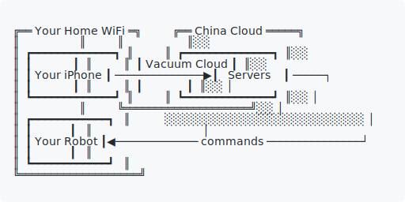
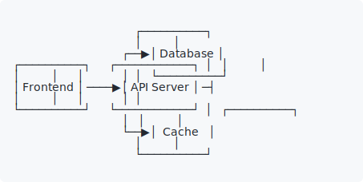
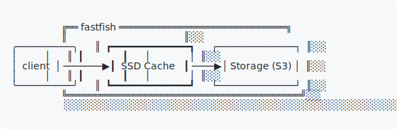
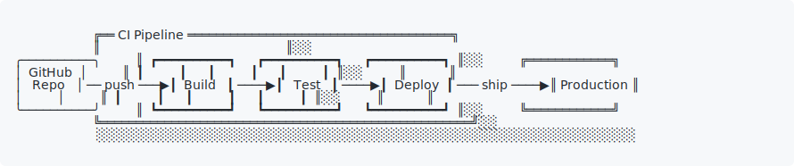

# box-of-rain

[](https://github.com/switz/box-of-rain/actions/workflows/test.yml)
[](https://bundlejs.com/?q=box-of-rain)
[](https://www.npmjs.com/package/box-of-rain)

Generate ASCII box diagrams from JSON, YAML, or Mermaid. Supports nested boxes, arrow connections, auto-layout, multiple border styles, and shadows. Can output as plain text or SVG. CLI or programmatic.

This code is entirely AI generated. Be warned, take it for what you will. No promises.

It's inspired by turbopuffer's, planetscale's, and oxide computing's ascii diagrams. It's meant to be a simple and effective way to generate diagrams through a rote interface, largely self-layouting.

Of course, it's named as an homage to the inimitable Robert Hunter. Though he'd likely be disgusted, everything written below here is AI generated as well. But tiny, useful, isolated, and non-hosted libraries are probably the best use-case for AI.

## Examples

These examples are SVGs because Github doesn't allow for customizing line-height of code blocks. If you put this on a website, you might want to set `line-height: 1` to avoid clipping.

<picture>
  <source media="(prefers-color-scheme: dark)" srcset="docs/microservices.svg">
  
</picture>

<picture>
  <source media="(prefers-color-scheme: dark)" srcset="docs/vacuum.svg">
  
</picture>

## Install

```bash
npm install box-of-rain
```

## CLI Usage

```bash
box-of-rain diagram.json          # render a diagram from JSON
box-of-rain diagram.yaml          # render a diagram from YAML
box-of-rain diagram.mmd           # render a diagram from Mermaid
box-of-rain --mermaid diagram.txt # force Mermaid parsing
box-of-rain --svg diagram.json    # SVG output
box-of-rain --example             # run the built-in example

npx box-of-rain --example
```

## Schema

A diagram is a recursive tree of nodes. Each node can contain text or nested child nodes. Connections can be defined at any level.

```json
{
  "children": [
    {
      "id": "web",
      "children": ["Frontend"],
      "border": "rounded"
    },
    {
      "id": "platform",
      "title": "Cloud Platform",
      "border": "double",
      "shadow": true,
      "children": [
        { "id": "api", "children": ["API Server"], "border": "bold" },
        { "id": "db", "children": ["Database"] }
      ],
      "connections": [
        { "from": "api", "to": "db" }
      ]
    }
  ],
  "connections": [
    { "from": "web", "to": "api", "label": "HTTPS" }
  ]
}
```

<picture>
  <source media="(prefers-color-scheme: dark)" srcset="docs/example-mermaid.svg">
  
</picture>

### `children` is polymorphic

- `"children": "Hello"` — single line of text
- `"children": ["Line 1", "Line 2"]` — multi-line text
- `"children": [{ "id": "a", ... }]` — nested child boxes (recursive)

### Node properties

| Property         | Type                        | Default    | Description                                    |
|------------------|-----------------------------|------------|------------------------------------------------|
| `id`             | string                      | —          | Unique identifier (required for connections)   |
| `children`       | string \| string[] \| Node[] | —         | Text content or nested boxes                   |
| `border`         | string                      | `"single"` | `single`, `double`, `bold`, `rounded`, or `dashed` |
| `title`          | string                      | —          | Text on the top border                         |
| `shadow`         | boolean                     | `false`    | Adds a `░` shadow on the right and bottom      |
| `disabled`       | boolean                     | `false`    | Shade with `░` and strikethrough title          |
| `childDirection` | string                      | `"horizontal"` | `horizontal` or `vertical` child layout   |
| `x`, `y`         | number                      | auto       | Position (top-left corner)                     |
| `width`, `height` | number                     | auto       | Box dimensions in characters                   |
| `connections`    | Connection[]                | —          | Connections between child IDs at this level     |

### Connection properties

| Property   | Type   | Default   | Description                            |
|------------|--------|-----------|----------------------------------------|
| `from`     | string | —         | Source box `id`                        |
| `to`       | string | —         | Target box `id`                        |
| `label`    | string | —         | Text label on the arrow                |
| `fromSide` | string | auto      | Which side the arrow exits from        |
| `toSide`   | string | auto      | Which side the arrow enters            |

Sides are `right`, `left`, `top`, or `bottom`. When omitted, sides are auto-detected based on relative box positions.

## Mermaid Support

You can write diagrams in [Mermaid](https://mermaid.js.org/) syntax instead of JSON/YAML. Flowcharts and sequence diagrams are supported.

### Flowchart

```
flowchart LR
    subgraph home1[Your Home WiFi]:::shadow
        iphone((Your iPhone))
        robot((Your Robot))
    end
    subgraph cloud[China]:::shadow
        server{Company Servers}
    end
    iphone -->|data| server
    server -->|commands| robot
    %% @route server-->robot toSide=right
```

```
╔══ Your Home WiFi ═╗            ╔══ China ══════════════╗
║                   ║░░          ║                       ║░░
║  ┏━━━━━━━━━━━━━┓  ║░░          ║  ┌┄┄┄┄┄┄┄┄┄┄┄┄┄┄┄┄┄┐  ║░░
║  ┃             ┃  ║░░          ║  ┆                 ┆  ║░░
║  ┃ Your iPhone ┃ ───── data ─────▶┆ Company Servers ┆ ─────┐
║  ┃             ┃  ║░░          ║  ┆                 ┆  ║░░ │
║  ┗━━━━━━━━━━━━━┛  ║░░          ║  └┄┄┄┄┄┄┄┄┄┄┄┄┄┄┄┄┄┘  ║░░ │
║                   ║░░          ╚═══════════════════════╝░░ │
║  ┏━━━━━━━━━━━━━┓  ║░░           ░░░░░░░░░░░░░░░░░░░░░░░░░░ │
║  ┃             ┃  ║░░                                      │
║  ┃ Your Robot  ┃◀─────────────── commands ─────────────────┘
║  ┃             ┃  ║░░
║  ┗━━━━━━━━━━━━━┛  ║░░
╚═══════════════════╝░░
 ░░░░░░░░░░░░░░░░░░░░░░
```

Supported flowchart features:

- **Direction:** `flowchart LR`, `RL`, `TD`/`TB`, `BT` (also `graph`)
- **Node shapes** map to border styles:

  | Mermaid | Border |
  |---------|--------|
  | `A[text]` | `single` |
  | `A(text)` / `A([text])` | `rounded` |
  | `A[[text]]` / `A[(text)]` | `double` |
  | `A((text))` / `A{{text}}` | `bold` |
  | `A{text}` | `dashed` |

- **Edges:** `-->`, `---`, `-.->`, `==>` with optional `|label|` or `-- label -->` syntax
- **Chained edges:** `A --> B --> C`
- **Subgraphs:** `subgraph id[Title] ... end`, including nesting
- **Comments:** `%%`
- **Semicolons:** `A[One]; B[Two]` on the same line
- **Quoted text:** `A["Hello World"]`
- **Line breaks:** `A[Line 1<br>Line 2]`

### Sequence diagrams

```
sequenceDiagram
    participant A as Alice
    participant B as Bob
    A->>B: Hello
```

```
┌── Alice ──┐           ┌── Bob ────┐
│           │           │           │
│  ┌─────┐  │           │  ┌─────┐  │
│  │     │ ──── Hello ────▶│     │  │
│  └─────┘  │           │  └─────┘  │
└───────────┘           └───────────┘
```

Supported sequence features:

- `participant` and `actor` declarations (actors get `rounded` borders)
- Aliases: `participant A as Alice`
- Message types: `->>`, `-->>`, `-x`, `--x`, `-)`, `--)`
- Implicit participants from messages

### Extensions

Two library-specific extensions are available using Mermaid-compatible syntax:

**`:::shadow`** — adds a shadow to a node or subgraph:

```
A[Server]:::shadow
subgraph cloud[Cloud]:::shadow
```

**`%% @route`** — controls connection routing with `fromSide`/`toSide`:

```
%% @route server-->robot toSide=right
%% @route A-->B fromSide=bottom toSide=top
```

## Arrow routing

Arrows are routed automatically based on the anchor positions:

- **Straight** — when source and target are on the same row
- **L-shaped** — horizontal, corner, vertical, corner, horizontal
- **U-shaped** — when `fromSide` and `toSide` are the same (e.g. both `"right"`), the arrow extends past all boxes, turns vertical, and comes back

## Border styles

```
single:  ┌──────┐    double:  ╔══════╗    bold:  ┏━━━━━━┓    rounded: ╭──────╮    dashed: ┌┄┄┄┄┄┄┐
         │      │             ║      ║           ┃      ┃             │      │            ┆      ┆
         └──────┘             ╚══════╝           ┗━━━━━━┛             ╰──────╯            └┄┄┄┄┄┄┘
```

## Auto-layout

When boxes don't have explicit `x`/`y` positions, the layout engine:

1. Sizes each box to fit its content
2. Lays out children inside their parent containers
3. Assigns top-level boxes to horizontal layers based on connection flow
4. Orders boxes within each layer to minimize edge crossings
5. Handles cycles in the dependency graph

You can mix auto and manual positioning — set `x`/`y`/`width`/`height` on specific boxes and leave the rest to auto-layout.

## Programmatic usage

```typescript
import { render, renderSvg } from 'box-of-rain';

const diagram = {
  children: [
    { id: 'a', children: ['Hello'], border: 'double' },
    { id: 'b', children: ['World'], border: 'bold' },
  ],
  connections: [
    { from: 'a', to: 'b' },
  ],
};

console.log(render(diagram));

// Or as SVG:
const svg = renderSvg(render(diagram));
```

### From Mermaid

```typescript
import { renderMermaid, parseMermaid } from 'box-of-rain';

// One-step render:
console.log(renderMermaid(`
  flowchart LR
    A[Frontend] --> B[API] --> C[Database]
`));

// Or parse first, then render:
import { render } from 'box-of-rain';
const nodeDef = parseMermaid(`
  sequenceDiagram
    Alice->>Bob: Hello
    Bob-->>Alice: Hi
`);
console.log(render(nodeDef));
```

Input is validated at runtime with Zod. Invalid schemas throw a `ZodError` with details.

## Development

```bash
pnpm install
pnpm test        # run tests
pnpm typecheck   # type-check
pnpm build       # build to dist/
```

## More Examples

<picture>
  <source media="(prefers-color-scheme: dark)" srcset="docs/fastfish.svg">
  
</picture>

<picture>
  <source media="(prefers-color-scheme: dark)" srcset="docs/pipeline.svg">
  
</picture>

## License

MIT
